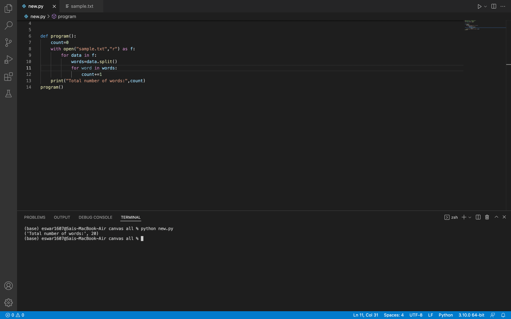
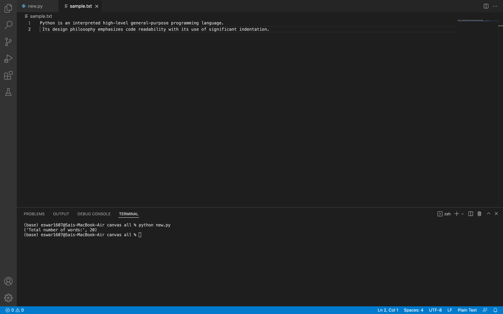

# Word-count
## AIM:
To write a python program for getting the word count from a text.
## EQUIPEMENT'S REQUIRED: 
PC
Anaconda - Python 3.7
## ALGORITHM: 
### Step 1:
open text.txt as fp

### Step 2: 
add content to the text.txt file
 
### Step 3: 
use reas mode to read the text.txt

### Step 4:  
split the words in the file using split ()

### Step 5: 
use len(word) to find total number of words

### Step 6: 
print the output

## PROGRAM:
~~~
##Developed by : Sandeep Challa
##Register number: 21003698
def program():
    count=0
    with open("text.txt","r") as f:
        for data in f:
            words=data.split()
            for word in words:
                count+=1
    print("Total number of words:",count)
program()
~~~

### OUTPUT:

## RESULT:
Thus the program is written to find the word count from a text.
